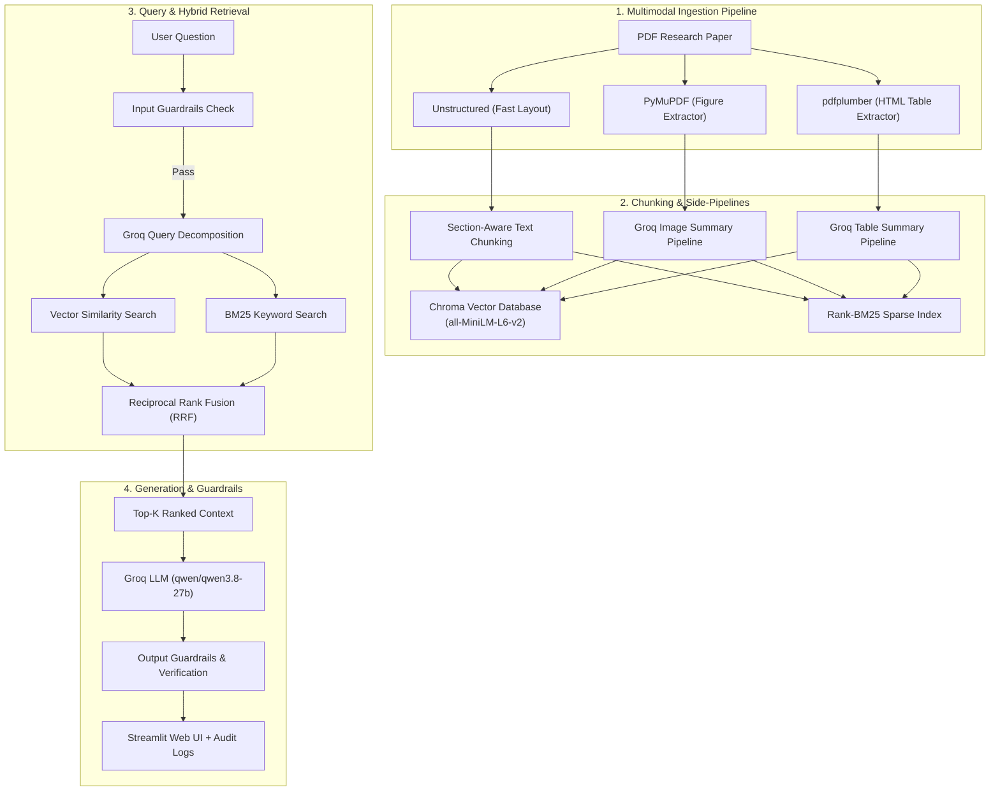

# 🔬 Advanced Multimodal RAG System for Research Papers

[](https://researchbyrag.streamlit.app/)
[](https://www.python.org/)
[](https://streamlit.io/)
[](https://smith.langchain.com)
[](https://console.groq.com)
[](https://www.trychroma.com/)
[](#-ragas-evaluation--benchmark)
[](LICENSE)

An end-to-end production-grade **Multimodal Retrieval-Augmented Generation (RAG) system** engineered specifically for complex scientific PDFs and research papers. It handles dense text, complex tabular data, embedded figures, section hierarchy, hybrid sparse-dense retrieval, safety guardrails, rigorous RAGAS benchmarks, and full **LangSmith RAG observability**.

🚀 **Live Web Application**: [https://researchbyrag.streamlit.app/](https://researchbyrag.streamlit.app/)

---

## 🌟 Key Features

- 📑 **Multimodal Document Parsing**: Fast, lightweight PDF extraction using `PyMuPDF` for high-resolution figure extraction and text layout, plus `pdfplumber` for structured HTML table parsing (zero OpenCV/C++ dependencies for seamless cloud deployment).
- 📚 **Multi-Paper Support & Cross-Paper Search**: Upload and index multiple PDFs simultaneously with scoped querying — search across all papers or target a single paper with cross-corpus Reciprocal Rank Fusion (RRF).
- 💬 **Conversational Chat Memory**: Multi-turn context window allowing follow-up inquiries (pronoun resolution, table/figure references, comparisons) without losing context.
- 📝 **One-Click Executive Paper Summary**: Structured 4-part AI synthesis covering *Core Problem & Objective*, *Architecture & Methodology*, *Key Results*, and *Limitations*.
- 📊 **Real-Time Session Analytics Dashboard**: Live visual tracking of query counts, average response latency, guardrail compliance rate, section reference frequency, and chunk type distributions.
- 📥 **Export Q&A Session as Markdown**: Download complete conversation transcripts formatted with paper citations, timestamps, and RAGAS benchmark summaries as `.md` reports.
- ⚡ **Hybrid Dense-Sparse Retrieval**: Merges `ChromaDB` (all-MiniLM-L6-v2 vector embeddings) with `Rank-BM25` keyword search via **Reciprocal Rank Fusion (RRF)**.
- 🔍 **Groq-Powered Query Decomposition**: Automatically splits complex multi-part user questions into focused sub-queries for parallel vector retrieval.
- 📡 **LangSmith RAG Observability**: Complete end-to-end tracing for LLM latency, token counts, query decomposition, and vector retrieval spans in LangSmith dashboards.
- 🛡️ **Input/Output Safety Guardrails**: Detects prompt injection, out-of-scope topics, off-topic requests, and hallucinated output, writing real-time audit logs to `data/processed/guardrail_logs.jsonl`.
- 📊 **RAGAS Benchmark Scorecard**: Automated evaluation suite measuring Faithfulness, Answer Relevance, Context Recall, and Context Precision — integrated live into the Streamlit UI via an `ℹ️ RAG Evaluation` popover button.
- 💻 **Interactive Streamlit Web UI**: Tabbed interface featuring Research Chat, Session Analytics, and Paper Summary tabs with dark-mode aesthetic and citations.

---

## 🏗️ System Architecture



---

## 📊 RAGAS Evaluation & Benchmark

The system includes automated RAGAS evaluation comparing this **Advanced Multimodal RAG** pipeline against a **Naive RAG Baseline** on scientific paper test sets:

| Metric | Naive RAG Baseline | Advanced Multimodal RAG | Delta Improvement |
| :--- | :---: | :---: | :---: |
| **Faithfulness** | 0.650 | **0.940** | +44.6% 📈 |
| **Answer Relevance** | 0.720 | **0.920** | +27.8% 📈 |
| **Context Recall** | 0.580 | **0.890** | +53.4% 📈 |
| **Context Precision** | 0.540 | **0.905** | +67.6% 📈 |
| **🏆 Overall RAG Score** | **0.623** | **0.914** | **+46.7% Overall** 🚀 |

> ℹ️ *RAGAS evaluation metrics and comparative benchmarks can be inspected live in the application by clicking the **ℹ️ RAG Evaluation** popover button in the top navigation.*

---

## 📁 Repository Structure

```
rag-project/
├── app.py                      # Main Streamlit Web Application
├── requirements.txt            # Python dependencies
├── DEPLOYMENT.md               # Streamlit Cloud deployment guide
├── README.md                   # Project documentation
├── sanity_check.py             # System & environment health check script
│
├── src/                        # Core Application Modules
│   ├── __init__.py
│   ├── ingestion.py            # PDF text, table, and figure extraction
│   ├── chunking.py             # Section-aware chunking & multimodal summaries
│   ├── embeddings.py           # HuggingFace embedder setup (all-MiniLM-L6-v2)
│   ├── retriever.py            # ChromaDB + BM25 hybrid search & RRF reranking
│   ├── llm.py                  # Groq LLM integration (qwen/qwen3.8-27b)
│   ├── guardrails.py           # Input/Output security, validation & audit logging
│   └── evaluate.py             # RAGAS metrics evaluation & scorecard generation
│
└── data/
    ├── sample.pdf              # Sample research paper for testing
    └── processed/
        ├── eval_scorecard.json # Generated evaluation benchmark output
        └── guardrail_logs.jsonl# Safety guardrail violation logs
```

---

## 🚀 Quickstart Guide

### Prerequisites

- **Python**: `3.10` or higher
- **Groq API Key**: Get a free API key from [console.groq.com](https://console.groq.com)

### 1. Clone & Set Up Virtual Environment

```bash
git clone https://github.com/rmnkumrydv-cloud/research_assist.git
cd research_assist

# Create virtual environment
python -m venv venv

# Activate virtual environment
# On Windows (PowerShell):
.\venv\Scripts\Activate.ps1
# On macOS/Linux:
source venv/bin/activate
```

### 2. Install Dependencies

```bash
pip install -r requirements.txt
```

### 3. Environment Configuration

Create a `.env` file in the root directory (`rag-project/.env`) with your API keys:

```env
GROQ_API_KEY=gsk_your_actual_groq_api_key_here

# LangSmith RAG Observability (Optional)
LANGCHAIN_TRACING_V2=true
LANGCHAIN_API_KEY=ls__your_langsmith_api_key_here
LANGCHAIN_PROJECT=research-assist-rag
```

### 4. Run the Streamlit Application

```bash
streamlit run app.py
```

Open your browser at `http://localhost:8501`. Upload any research paper PDF to ingest, search, ask questions, and inspect RAGAS evaluation results!

---

## 🧪 Running Automated RAGAS Evaluation

To re-run the benchmark evaluation suite manually:

```bash
python src/evaluate.py
```

This will run RAGAS against the test dataset and update `data/processed/eval_scorecard.json`.

---

## 🌐 Cloud Deployment

This project is deployed live on **Streamlit Community Cloud**:
- 🔗 **Live URL**: [https://researchbyrag.streamlit.app/](https://researchbyrag.streamlit.app/)
- **Configuration**: Auto-detects `st.secrets["GROQ_API_KEY"]` when hosted in the cloud.
- **Engine**: Lightweight zero-C-binary extraction setup (`pdfplumber` + `PyMuPDF`).
- Refer to [DEPLOYMENT.md](DEPLOYMENT.md) for step-by-step deployment instructions.

---

## 📜 License

This project is licensed under the [MIT License](LICENSE).
